<!-- ===== conversion report ===== -->
input: 概率统计第12章 平稳过程revbyzuo.pdf
pages: 65
images: 5

> ⚠️ Pages 7-26, 28-47, 49-58, 60, 62, 65: dense math — formulas extract poorly (one symbol per line). Verify manually if formulas matter.

<!-- ===== end report ===== -->

**12 第 章 平稳过程** 

##### **12.1 平稳过程的概念** 

**12.2 相关函数的性质** 

**12.3 平稳过程的谱密度** 

**12.4 各态历经性** 

 

###### 粗略的说，平稳过程是指的其统计特性不随时间的推移而改变的过程 . 平 稳过程主要有严平稳过程和宽平稳过程 

 推荐系统中：用户行为模型和物品 特征模型可以被看作是一种平稳随 机过程。例如，用户行为序列和物 品特征向量等可以通过平稳随机过 程来描述，从而建立更加准确的推 荐模型 

 自然语言处理中：在自然语言处理 中，许多任务如文本摘要、机器翻 译和情感分析等都可以被看作是一 种平稳随机过程 

#### **12.1 平稳过程的概念** 

**1. 严平稳过程 定义 1** 设 { _X_ ( _t_ ), _t_ ≥0} 为随机过程，若对任意 _n_ 个时刻 _t_ 1, _t_ 2,…, _tn_ ∈ _T_ 及任意 _τ_ , _t_ 1+ _τ_ , _t_ 2+ _τ_ , …, _tn_ + _τ_ ∈ _T_ , _d X t X t X t_ = _X t_ +τ _X t_ +τ _X t_ +τ ( ( 1), ( 2 ),..., ( _n_ ) ) ( ( 1 ), ( 2 ),..., ( _n_ ) ) **_X t_ 则称 ( ) 为严平稳过程** 

**注：** 严平稳过程的任何有限维分布对时间的推移是保持不 变的 

#### **2. 严平稳过程的特点** 

- 严平稳过程 _X_ ( _t_ ) 的一维分布与 _t_ 无关 

- 二维分布仅与时间差有关，而与时间起点无关 

- 若严平稳过程存在二阶矩，则 

- 1 _m t E X t c c_ 

- （ ）均值函数为常数： ( )= [ ( )]= ， 为常数 

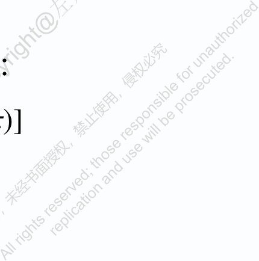

<!-- Start of picture text -->
)] <!-- End of picture text -->

- （ 2 ）相关函数仅是时间差的函数： 

_R t t_ + _τ E X t X t_ + _τ E X X τ_ ( , )= [ ( ) ( )]= [ (0) ( )] 

#### **3. 宽平稳过程** 

**定义 2** 设 { _X_ ( _t_ ), _t_ ≥0} 为二阶矩过程，若它满足条件 

- 1 _E X t m m_ 

- （ ） [ ( )]= , 为常数 

- （ 2 ）对任意的 _t_ ∈ _T_ , _τ_ ∈ _T_ , _E_ [ _X_ ( _t_ ) _X_ ( _t_ + _τ_ )] 不依赖于 _t_ 

#### _X t_ 则称 ( ) 为宽平稳过程，简称平稳过程 _T X t_ 当 为整数集 , 则称 ( ) 为宽平稳时间序列 对平稳过程，用 _RX_ ( _τ_ ) 表示 _X_ ( _t_ ) 的相关函数 

#### **注 1 严平稳过程不一定是宽平稳过程** 

因为严平稳过程不一定是二阶矩过程 若严平稳过程存在二阶矩，则它一定是宽平稳过程 **注 2 宽平稳过程也不一定是严平稳过程** 因为宽平稳过程只保证一阶矩和二阶矩不随时间推移而 改变，这当然不能保证其有穷维分布不随时间而推移 **注 3 若 {** **_X_ (** **_t_ ),** **_t_ ≥0} 为 Gauss 过程，则** **_X_ (** **_t_ ) 为严平稳过程的充要条 件** **_X_ (** **_t_ ) 是宽平稳过程 注 4 利用均值函数与协方差函数（相关函数）也可讨论随机 过程的平稳性** 

**协方差函数** = _C t_ +τ _t Cov X t_ +τ _X t_ ( , ) [ ( ), ( )] = − _E X t_ +τ _X t E X t E X t_ +τ [ ( ) ( )] [ ( )] [ ( )] 2 = − _R_ τ _m X_ ( ) 

即表示协方差函数仅依赖于时间间隔 _τ_ ，而与 _t_ 无关 

**例 1** 设 { _X_ ( _n_ ), _n_ =0, ± 1, ± 2,…} 是相互独立同分布的随机变量序列 **，** 2 且均值和方差为 _E_ [ _X_ ( _n_ )] = 0, _D_ [ _X_ ( _n_ )] = σ 

_X n_ 试讨论随机变量序列 ( ) 的平稳性 = **解 :** 因为 _E_ [ _X_ ( _n_ )] 0 2 = σ , τ 0 = _R_ τ _E X n_ +τ _X n X_ ( ) [ ( ) ( )] =  τ ≠ 0  0, _n X n_ 不依赖于 ，故 ( ) 是平稳过程 

1 ” **注** 在科学和工程中，例 中的过程称为纯随机序列或“白噪声 （ white  noise ） . 若 _X_ ( _t_ ) ~ _N_ (0, _τ_ ) ，则称其为正态白噪声 

**例 2*** 设随机序列 { _X_ ( _t_ )=sin(2π _tη_ ),         } _t_ ∈ _T_ ，其中 _T_ ={1,2,…} ， _η_ 在 _X t_ [0,1] 上服从均匀分布，试讨论随机序列 ( ) 的平稳性  ,1 0 ≤ _x_ ≤ 1 **解 :** _η_ 的密度函数为 _f_ ( _x_ ) =  0, 其它  1 = = _E X t_ sin 2 π _txdx_ 0 所以 [ ( )] ∫ 0 1  1 = ，当 τ 0 = = _RX_ ( τ ) sin 2 π ( _t_ +τ ) _x_ sin 2 π _txdx_  2∫ 0 0，当 τ ≠ 0  

_X t_ 故 ( ) 是平稳随机序列 

**注** 例 2 中的过程是宽平稳的，但不是严平稳的 

#### **例 3** 设 { _X_ ( _t_ ), _t_ =0, ± 1, ± 2,…} 是白噪声序列 . 

_N_ 令 _Y_ ( _t_ ) = ∑ _ak X_ ( _t_ − _k_ ) ，其中 _N_ 为自然数， _a_ 0, _a_ 1,…, _aN_ 为常数 _k_ = 0 _Y t_ 试证明 ( ) 是平稳序列 

_N_ **证 :** _E Y_ [ ( _t_ )] = ∑ _ak E_ [ _X_ ( _t_ − _k_ )] = 0 _k_ = 0 _N N_ = − − _E Y t Y t_ + τ _a a E X t k X t_ + τ [ ( ) ( )] ∑∑ _k j_ [ ( ) ( _j_ )] _k_ = 0 _j_ = 0 0 τ _N_  − | |> _N_ τ =  | | 2 _a a_ σ τ ≤ _N_ ∑ _k k_ +τ | |  _k_ = 0 故 _Y_ ( _t_ ) 是平稳过程 . 通常称 _Y_ ( _t_ ) 是白噪声序列的滑动和 

= − µ _t_ **例 4** 令 { _Y_ ( _t_ ) ( 1) _X_ , _t_ ∈ [0, +∞ ]} ，其中 − 1 1   ~ 1 _X X_ （ ） 为随机变量，且    1/ 2 1/ 2  （ 2 ） { _μt_ , _t_ ≥0} 是强度为 _λ_ 的泊松过程 （ 3 ） _X_ 与 { _μt_ , _t_ ≥0} 相互独立 _Y t_ 证明 ( ) 是平稳过程 **解 :** _E Y_ [ ( _t_ )] = _E_ [( − 1) µ _t X_ ] = _E_ [( − 1) µ _t_ ] _E_ [ _X_ ] =0 _E Y_ [ ( _t_ ) _Y_ ( _t_ + τ )] = _E_ [( − 1) µ _t X_ ( − 1) µ _t_ +τ _X_ ] = _E_ [( − 1) µ _t_ +µ _t_ +τ _X_ 2 ] = _E_ [( − 1) µ _t_ +µ _t_ +τ ] _E_ [ _X_ 2 ] = _E_ [( − 1) µ _t_ +µ _t_ +τ ] = _E_ [( − 1) µ _t_ +τ− µ _t_ ] − ~ 当 τ > 0时， µ _t_ +τ µ _t__P_ ( λτ ), ∞ _k E_ [( − 1) µ _t_ +τ− µ _t_ ] = ∑ ( − 1) _k_ <u>(</u> λτ <u>)</u> _e_ −λτ = _e_ − 2 λτ _k_ = 0 _k_ ! 当 τ < 0时， µ _t_ +τ − µ _t_ ~_P_ ( −λτ ), _E_ [( − 1) µ _t_ +µ _t_ +τ ] = _e_ 2 λτ _Y t_ 故 ( ) 是平稳过程 

#### **11.2 相关函数的性质** 

#### **1. 自相关函数的性质** 

= _X X t t_ ∈ _T X_ 设 _T_ { ( ), } 为平稳过程， _T_ 的自相关函数为 = _RX_ ( τ ) _E_ [ _X_ ( _t_ ) _X_ ( _t_ +τ )]， 则 _RX_ ( _τ_ ) 具有以下性质： （ 1 ） _RX_ (0) ≥ 0 （ 2 ） | _RX_ ( τ ) | ≤ _RX_ (0) （ 3 ） _RX_ ( −τ ) = _RX_ ( τ ) （ 4 ）则 _RX_ ( _τ_ ) 是非负定的，即对于任意 _n_ 个实数 _t_ 1, _t_ 2,…, _tn_ 和 复数 _z_ 1, _z_ 2,…, _zn_ , 都有 

_n n_ − _RX_ ( _tk tl_ ) _zk_ _~~z~~ l_ ≥ 0 ∑∑ _k_ = 1 _l_ = 1 

- . 

- 上述四条性质中，非负性是平稳过程自相关函数的本质特性 _t_ =0 _t_ 

- 可以证明任一（在 处连续且 _f_ (0)≠0 的）函数 _f_ ( ) 若是非负定 的，则它必是某平稳过程的自相关函数 

**2. 自协方差函数的性质** = _X X t t_ ∈ _T X_ 设 _T_ { ( ), } 为平稳过程， _T_ 的自协方差函数为 _CX_ ( τ ) = _Cov_ ( _X_ ( _t_ ), _X_ ( _t_ +τ ))， 则 _CX_ ( _τ_ ) 具有以下性质： （ 1 ） _CX_ (0) ≥ 0 （ 2 ） | _CX_ ( τ ) | ≤ _CX_ (0) （ 3 ） _CX_ ( −τ ) = _CX_ ( τ ) 4 （ ）则 _CX_ ( _τ_ ) 是非负定的，即对于任意 _n_ 个实数 _t_ 1, _t_ 2,…, _tn_ 和 复数 _z_ 1, _z_ 2,…, _zn_ , 都有 _n n_ − _CX_ ( _tk tl_ ) _zk_ _~~z~~ l_ ≥ 0 ∑∑ _k_ = 1 _l_ = 1 

#### **3. 互相关函数的性质** 

= = 设 _X X t t_ ∈ _T_ 和 _Y t t_ ∈ _T_ 为两个平稳过程，若 _T_ { ( ), }_Y_ _T_ { ( ), } _E_ [ _X_ ( _t_ ) _Y_ ( _t_ + _τ_ )] 不依赖于 _t_ ，则称 _XT_ 和 _YT_ 是平稳相关的 . 他们的互相 关函数为 = _R_ τ _E X t Y t_ +τ _XY_ ( ) [ ( ) ( ) ] 其性质为 （ 1 ） _RXY_ ( −τ ) = _RYX_ ( τ ) （ 2 ） _R_ τ ≤ _R R_ | _XY_ ( ) | _X_ (0) _Y_ (0) _XTT_ 与 _YTT_ 是的互协方差函数为 = = − _CXY_ ( τ ) _Cov_ ( _X_ ( _t_ ), _Y_ ( _t_ +τ )) _E_ [ _X_ ( _t_ ) _Y_ ( _t_ +τ ) ] _mX_ ( _t_ ) _mY_ ( _t_ +τ ) = − _R_ τ _m m XY_ ( ) _X Y_ 即 _XT_ 与 _YT_ 的互协方差函数也不依赖于 _t_ 

_XTT_ 与 _YTT_ 是的互协方差函数为 

#### **11.3 平稳过程的谱密度** 

#### **1. 相关函数的谱分解** 

**定理 1** (1) 设 _X_ ( _t_ ) 是均方连续的平稳过程，则它的自相关函数 _RX_ ( _τ_ ) 可以表示为 ∞  1 τω _j_ = _R_ τ _e dF_ ω −∞< τ < +∞ _X_ ( ) ( ), ∫−∞ 2 π  _F_ ω _R_ 其中 ( ) 是定义在 上的单调非降、右连续的有界函数 _X n_ ± ± _R m_ (2) 平稳随机序列 { ( ),0, 1, 2,…} 的相关函数 _X_ ( ) ，则 

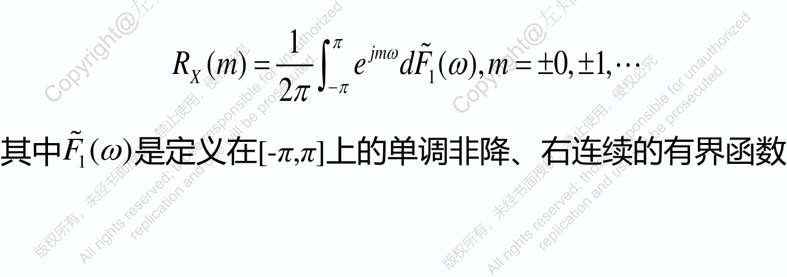

###  若 _F_ ( ω ) 绝对连续，则存在 _SX_ ( _ω_ ) 使得 

 ω = _F_ ω _S_ ω _d_ ω + _C_ −∞< ω < +∞ ( ) _X_ ( ) , , ∫−∞  ′ = _F_ ( ω ) _S X_ ( ω ) **相当于分布函 数和密度函数** _SX_ (ω) 称为 **谱密度** 

若 _RX_ ( _τ_ ) 绝对可积， _RX_ ( _τ_ ) 可以表示为 

+ ∞ 1 _i_ τω = _R_ τ _e S_ ω _d_ ω −∞< τ < +∞ _X_ ( ) _X_ ( ) , ∫−∞ 2 π + ∞ − _i_ τω = 其中 _S X_ ( ω ) _e RX_ ( τ ) _d_ τ ∫−∞ 相关函数 _RX_ ( _τ_ ) 与谱密度 _SX_ ( _ω_ ) 构成了 **傅里叶（ Fourier ）变换对** = _S X_ ( ω )  [ _RX_ ( τ )] − 1 = _RX_ ( τ )  [ _S X_ ( ω )] 

#### _X X n n_ ± ± _R m_ 对于平稳序列 _T_ ={ ( ), =0, 1, 2,…} 的相关函数 _X_ ( ) ，若它满 

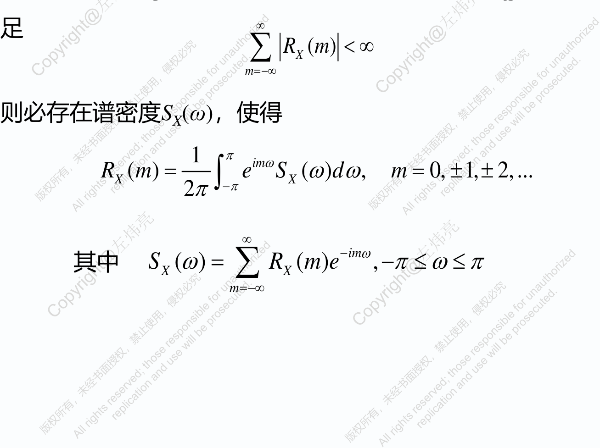

<!-- Start of picture text -->
∞ 足 R m < ∞ ∑ X ( ) m =−∞ 则必存在谱密度 SX ( ω ) ，使得 1 π im ω = = R m e S ω d ω m ± ± X ( ) X ( ) , 0, 1, 2,... ∫−π 2 π ∞ − im ω = − S ω R m e π ≤ ω ≤ π 其中 X ( ) X ( ) , ∑ m =−∞ <!-- End of picture text -->

#### **2. 谱密度的物理意义** 

- 确定性信号 _x_ ( _t_ ) 的功率谱密度 

_x t t x t_ 设非随机信号 ( ) 是时间 的非周期实函数，且 ( ) 满足  _x_ ( _t_ ) 在 (-∞,+ ∞) 范围内满足 Dirichlet 条件 +∞  _x_ ( _t_ ) **绝对可积，即** ∫−∞ _x_ ( _t_ ) _dt_ < ∞ _x t x t_ 则 ( ) 的傅立叶变换存在，即可求得 ( ) 的频谱函数 + ∞ − _i_ ω _t_ = _F_ ω _x t e dt X_ ( ) ( ) ∫−∞ _x t F ω_ ( ) 称为 _X_ ( ) 的反变换，即 + ∞ 1 _i_ ω _t_ = _x t e F_ ω _d_ ω ( ) _X_ ( ) ∫−∞ 2 π _FX_ ( _ω_ ) 称为 _x_ ( _t_ ) 的频谱密度函数， | _FX_ ( _ω_ )| 称为 _x_ ( _t_ ) 振幅频谱 

**连续或至多有有限 个第一类间断点 有限个极值点** 

2 +∞ _x_ ( _t_ ) _dt_ < ∞，则有帕塞瓦尔（ Parseval ）等式 − ∫ ∞ ∞ ∞ ∞ 1 2 _i_ ω _t_ = _x t dt x t F_ ω _e d_ ω _dt_ [ ( )] ( ) _X_ ( ) ∫−∞ ∫−∞ ∫−∞ 2 π ∞ ∞ 1 _i_ ω _t_ **_x_ (** **_t_ )** 的总能量 = _FX_ ( ω ) _x_ ( _t_ ) _e dtd_ ω ∫−∞ ∫−∞ 2 π ∞ 1 = _F_ ω _F_ ω _d_ ω _X_ ( ) _X_ ( ) ∫−∞ 2 π ∞ 1 2 = _F_ ω _d_ ω _X_ ( ) ∫−∞ 2 π _x t_ ( ) 的能量谱密度 帕塞瓦尔等式又可理解为总能量的谱表示式 

#### • 若 

_x t_ ( ) 的能量谱密度 

2 +∞ 在实际应用中，可能存在 _x_ ( _t_ ) _dt_ = ∞ ∫−∞ 此时 _x_ ( _t_ ) 的傅立叶变换不存在 . 我们研究 _x_ ( _t_ ) 在 (-∞ ,+∞) 上的平 均功率，即 _T_ 1 2 lim _x_ ( _t_ ) _dt_ − _T_ →∞ ∫ _T_ 2 _T_ **平均功率的谱表示式** _x t_ 由给定的 ( ) 构造一个截尾函数  _x_ ( _t_ )， _t_ ≤ _T_ 绝对可积 _x t T_ ( ) =  0， _t_ > _T_  _x t T_ ( ) 的傅里叶变换为 

+∞ _T_ − − i ω _t_ i ω _t_ = = _FX_ ( ω , _T_ ) _xT_ ( _t_ ) _e dt_ (_t_ )_e_ _dt_ ∫−∞ ∫− _T__x_ 

#### 它的帕塞瓦尔等式 

+∞ +∞ 1 2 2 = _x t t F_ ω _T d_ ω _T_ ( )d _X_ ( , ) ∫−∞ ∫−∞ 2π 变形得 _T_ +∞ 1 2 2 =_t_ _t F_ ω _T_ d ω ( )d _X_ ( , ) ∫− _T__x_ ∫−∞ 2π _T_ +∞ 1 1 1 2 2 = lim _x t t_ lim _F_ ω _T_ d ω ( )d _X_ ( , ) − _T_ →+∞ ∫ _T_ ∫−∞ _T_ →+∞ 2 _T_ 2π 2 _T_ **_x_ (** **_t_ ) 在（ -∞ ， +∞ ） 称为** **_x_ (** **_t_ ) 的 上的平均功率 功率谱密度** 

**称为** **_x_ (** **_t_ ) 的 功率谱密度** 

#### **3. 平稳随机信号** **_X_ (** **_t_ ) 的功率谱密度** 

_T_ +∞ 1 1 1 2 2 = _t dt F_ ω _T d_ ω ( ) _X_ ( , ) ∫− _T__X_ ∫−∞ 2 _T_ 2 π 2 _T_ 对上式两端取平均 _T_ + ∞ 1 1 1 2  2    = _E X t dt E F_ ω _T d_ ω ( ) _X_ ( , )  2 _T_ ∫− _T_   2 π ∫−∞ 2 _T_      _T_ →∞ 当 ，取极限，交换数学期望和积分的次序，可得 _T_ + ∞ 1 1 1 2 2 =   lim _E X t dt_ lim _E F_ ω _T d_ ω [ ( )] _X_ ( , ) _T_ →∞ ∫− _T_ ∫−∞ _T_ →∞   2 _T_ 2 π 2 _T_ 1 2 令 _S_ ( ω ) = lim _E_  _FX_ ( ω , _T_ )  _T_ →∞   2 _T_ 称 _S_ (ω) 为 _X_ ( _t_ ) 的 **功率谱密度** 

_T_ 1  2  将 _T_ lim →+∞ _E_  ∫− _T X_ ( _t_ )d _t_  定义为平稳过程 _X_ ( _t_ ) 的平均功率 2 _T_   _T_ +∞ 1 1 1 2  2  lim _E X t dt_ = lim _E_  _F_ ω _T_  _d_ ω _T_ →+∞  2 _T_ ∫− _T_ ( )  2 π ∫−∞ _T_ →∞ 2 _T_  _X_ ( , )    1 _T_ 1 +∞ 2 = lim _E_ [ _X_ ( _t_ )] _dt S_ ( ω ) _d_ ω _T_ →+∞ ∫− _T_ ∫−∞ 2 _T_ 2 π 2 = _E_ [ _X_ ( _t_ )] _RX_ (0) +∞ 1 **故** _RX_ (0) = _S_ ( ω ) _d_ ω ∫−∞ 2 π 

_R X_ (0) 表示平稳随机信号的平均功率 

#### **功率谱密度和谱密度的关系** 

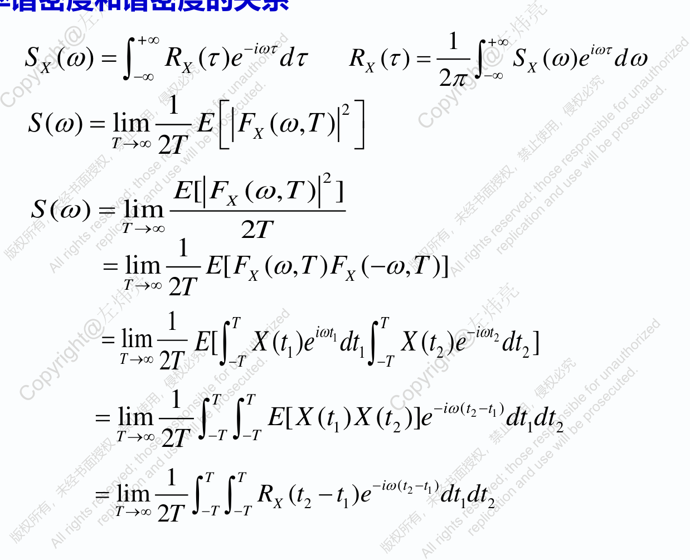

<!-- Start of picture text -->
+ ∞ − 1 + ∞ i ωτ i ωτ = = S X ( ω ) RX ( τ ) e d τ RX ( τ ) S X ( ω ) e d ω  ∫−∞ ∫−∞ 2 π 1 2 S ( ω ) = lim E  FX ( ω , T )  T →∞   2 T 2 E [ FX ( ω , T ) ] = S ( ω ) lim T →∞ 2 T 1 = − lim E [ FX ( ω , T ) FX ( ω , T )] T →∞ 2 T 1 T T − i ω t i ω t = 1 2 lim E [ X ( t 1) e dt 1 X ( t 2 ) e dt 2 ] T →∞ 2 T ∫− T ∫− T T T 1 − − i ω ( t 2 t 1 ) = lim E [ X ( t 1) X ( t 2 )] e dt dt 1 2 T →∞ ∫∫− T − T 2 T 1 T T − − = − i ω ( t 2 t 1 ) lim RX ( t 2 t 1) e dt dt 1 2 T →∞ ∫∫− T − T 2 T <!-- End of picture text -->

1 1 − _i_ ωτ 2 = 变量替换 _S_ ( ω ) lim _RX_ ( τ 2 ) _e d_ τ 1 _d_ τ 2 _T_ →∞ ∫∫ 2 _T_ 2 _H_ 2 _T_ 1 − _i_ ωτ = − 2 lim _T_ τ _R_ τ _e d_ τ (2 2 ) _X_ ( 2 ) 2 _T_ →∞ ∫− 2 _T_ 2 _T_ 2 _T_  τ  − _i_ ωτ = − lim 1 _R_ τ _e d_ τ   _X_ ( ) − _T_ →∞ ∫ 2 _T_  2 _T_   τ  − 1 _R_ τ τ < 2 _T T_ 令 _RXT_ ( τ ) =  2 _T_  _X_ ( ) , 则 _T_ lim →∞ _RX_ ( τ ) = _RX_ ( τ )  0 , τ > 2 _T_  +∞ − _T i_ ωτ = _S_ ( ω ) lim _RX_ ( τ ) _e d_ τ _T_ →∞ ∫−∞ +∞ +∞ − − _T i_ ωτ _i_ ωτ = = = lim _RX_ ( τ ) _e d_ τ _RX_ ( τ ) _e d_ τ _S X_ ( ω ) ∫−∞ _T_ →∞ ∫−∞ 即功率谱密度就是谱密度；也称自谱密度 

#### **4. 平稳随机过程谱密度的性质** 

 谱密度为非负的，即 _S X_ ( ω ) ≥ 0 2 _E F_ ω _T_ [ _X_ ( , ) ] = **证明：** _S_ ω lim _X_ ( ) _T_ →∞ 2 _T_ 2  _FX_ ( ω , _T_ ) ≥ 0 ∴ _S X_ ( ω ) ≥ 0 

 谱密度是实的偶函数，即 _S X_ ( ω ) = _S X_ ( −ω ) +∞ − _i_ ωτ = **证明：** _S X_ ( ω ) _RX_ ( τ ) _e d_ τ ∫−∞ +∞ +∞ = − _R_ τ ωτ _d_ τ _i R_ τ ωτ _d_ τ _X_ ( )cos _X_ ( )sin ∫−∞ ∫−∞ +∞ = 2 _R_ τ ωτ _d_ τ _X_ ( )cos **即谱密度为实的偶函数** ∫ 0 

**: 说明** 

- 

- 平稳过程在自相关函数绝对可积的条件下，维纳 辛钦 公式成立 

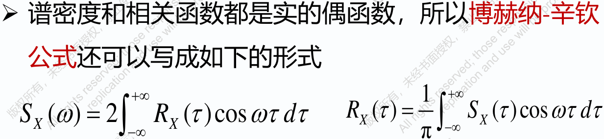

- 

- 博赫纳 辛钦公式又称为平稳过程自相关函数的谱表示 式 . 它揭示了从时间角度描述平稳过程 _X_ ( _t_ ) 的统计规律 _X t_ 

- 和从频率角度描述 ( ) 的统计规律之间的联系 

   - 在应用上我们可以根据实际情形选择时间域方法或 等价的频率域方法去解决实际问题 

#### **5. 互谱密度及其性质** 

若平稳过程 _X_ ( _t_ ) 、 _Y_ ( _t_ ) 是平稳相关的，当互相关函数满足 +∞ _R_ τ _d_ τ < ∞ | _XY_ ( ) | ∫ −∞ 则 _RXY_ ( _τ_ ) 的傅立叶变换存在 + ∞ − _i_ ωτ = _S XY_ ( ω ) _RXY_ ( τ ) _e d_ τ ∫−∞ + ∞ 1 _i_ ωτ = _RXY_ ( τ ) _S XY_ ( ω ) _e d_ ω ∫−∞ 2 π 

- 它们的互谱密度与其互相关函数互为傅立叶变换 

- 互谱密度是从频率的角度刻画两个平稳过程的平稳相关性 

**性质 1** _S XY_ ( ω ) = _SYX_ ( −ω ) = _SYX_ ( ω ) +∞ − _i_ ωτ **证明：** _S XY_ ( ω ) = _RXY_ ( τ ) _e d_ τ τ = −τ ∫−∞ （令 ） +∞ − _i_ ωτ = − _R_ τ _e d_ τ _YX_ ( ) ∫−∞ +∞ ωτ = _R_ τ _e__i_ _d_ τ _YX_ ( ) ∫−∞ = _SYX_ ( ω ) +∞ −− _i_ ( ω ) τ = _R_ τ _e d_ τ _YX_ ( ) ∫−∞ = _SYX_ ( −ω ) _ω_ 互谱密度不再是 的实的、正的偶函数 

> **2** = − 

> **性质** Re[ _S XY_ ( ω )] Re[ _S XY_ ( ω )] **证明：** Re[ _SYX_ ( ω )] = Re[ _SYX_ ( −ω )] + ∞ − _i_ ωτ = _S XY_ ( ω ) _RXY_ ( τ ) _e d_ τ ∫−∞ + ∞ = − _R_ τ ωτ + _i_ ωτ _d_ τ _XY_ ( )[cos sin( )] ∫−∞ +∞ = Re[ _S XY_ ( ω )] _R XY_ ( τ ) cos ωτ _d_ τ ∫−∞ +∞ = − _RXY_ ( τ ) cos ωτ _d_ τ （令 _τ_ **= -** τ ） ∫−∞ = Re[ _S XY_ ( −ω )] 

> **同理可证** Re[ _SYX_ ( ω )] = Re[ _SYX_ ( −ω )] 

**性质 3** Im[ _S XY_ ( ω )] = − Im[ _S XY_ ( −ω )] Im[ _SYX_ ( ω )] = − Im[ _SYX_ ( −ω )] 

2 证明：类似性质 证明 **性质 4** 互谱密度与自谱密度有不等式关系 _S XY_ ( ω ) ≤ _S X_ ( ω ) _SY_ ( ω ) 1 **证明：** = − _S_ ω lim _E F_ ω _T F_ ω _T XY_ ( ) { _X_ ( , ) _Y_ ( , ) } _T_ →∞ 2 _T_ 1 = − _S_ ω lim _E F_ ω _T F_ ω _T XY_ ( ) { _X_ ( , ) _Y_ ( , ) } _T_ →∞ 2 _T_ 1 2 2 − _S XY_ ( ω ) ≤ lim _E FX_ ( ω , _T_ ) _E FY_ ( ω , _T_ ) _T_ →∞ { } { } 2 _T_ 1 2 1 2 = − lim _E FX_ ( ω , _T_ ) lim _E FY_ ( ω , _T_ ) _T_ →∞ { } _T_ →∞ { } 2 _T_ 2 _T_ ≤ _S X_ ( ω ) _SY_ ( ω ) 

#### **6. 相关函数与谱密度之间的变换** 

+ ∞ + ∞ − 1 _i_ ωτ _i_ ωτ = = _S X_ ( ω ) _RX_ ( τ ) _e d_ τ _RX_ ( τ ) _S X_ ( ω ) _e d_ ω ∫−∞ ∫−∞ 2 π −β τ = 平稳随机过程的自相关函数为 _RX_ ( τ ) _Ae_ , _A_ >0, _β_ >0, 

# **例 5** 平稳随机过程的自相关函数为 求过程的功率谱密度 + ∞ − _i_ ωτ = **解：** _S X_ ( ω ) _RXX_ ( τ ) _e_ ∫−∞ 

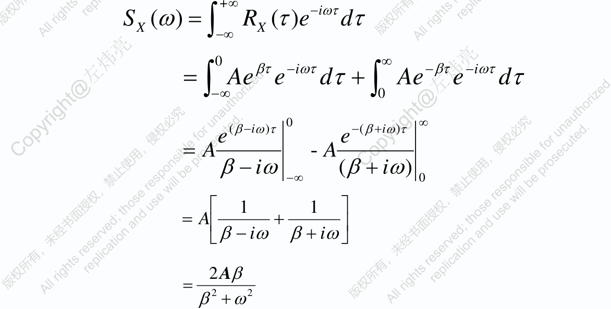

<!-- Start of picture text -->
+ ∞ − i ωτ S X ( ω ) = RXX ( τ ) e d τ  ∫−∞ 0 ∞ − − − βτ i ωτ βτ i ωτ = Ae e d τ + Ae e d τ ∫−∞ ∫ 0 ( β− i ω ) τ 0 − ( β+ i ω ) τ ∞ e e = A - A − i ω + i ω β −∞ ( β ) 0  1 1  = A + − i ω + i ω β β  2 A β = 2 2 + ω β <!-- End of picture text -->

#### **引入 δ 函数** 

= **例 6** 设 _X_ ( _t_ ) 为随机相位随机过程 _X_ ( _t_ ) _A_ cos( ω 0 _t_ + Φ ) ，其中 _A_ 、 _ω_ 0 是常数， Φ 为随机相位，在（ 0,2 _π_ ）服从均匀分布 . 求 _X_ ( _t_ ) 的功 率谱密度 = _R_ τ _E X t X t_ + τ **解：** _X_ ( ) [( ( ) ( )] 2 = _A E_ ω _t_ + Φ ω _t_ + ω τ + Φ [cos( 0 )cos( 0 0 )] 2 π 1 2 = _A_ ω _t_ + _x_ ω _t_ + ω τ + _x dx_ cos( 0 )cos( 0 0 ) ∫ 0 2 π 2 _A_ = ω τ cos( 0 ) 2 2 +∞ _A_ +∞ = _R_ τ _d_ τ ωτ _d_ τ ∫ － ∞ _X_ ( ) ∫ － ∞ cos( ) 2 上述积分不是有限值，即不可积，因此 _RX_ ( _τ_ ) 的傅里叶变换不存 _δ_ 在，需要引入 函数 

_δ δ t_ 上面所说的 函数是单位脉冲函数 ( ) 的简称，它是一种广义函 Dirac 数，由物理学家狄拉克（ ）引入 

_δ_ 函数定义 

∞ _x_ = _x_  0 − (1) δ ( _x x_ 0 ) =  0 _x_ ≠ _x_  0 +∞ (2) δ ( _x_ − _x_ 0 )d _x_ = 1, ∫−∞ 则称 δ ( _x_ − _x_ 0 )是在 _x_ = _x_ 0的函数 δ _δ_ 函数的基本性质 _x_ 对任一无穷次可微函数 _f_ ( ) ，有 +∞ δ ( _x_ − _x_ 0 ) _f_ ( _x_ )d _x_ = _f_ ( _x_ 0 ) ∫−∞ +∞ δ ( _x_ ) _f_ ( _x_ )d _x_ = _f_ (0) ∫−∞ 

#### 据此可以写出以下 **傅立叶变换对** ： 

+∞ − − _i_ ωτ _i_ ωτ = δ τ _e_ d τ _e_ 1 ( ) | τ= 0= ∫−∞ **1** +∞ +∞ 一般意义 **1** ⋅ **_e i_** ωτ d ω = δ **(** τ **)** ⇒ _ei_ ωτ _d_ ω = 2 πδ ( τ ) **2** π ∫−∞ ∫−∞ 不存在 当 _RX_ ( _τ_ )=1 时， +∞ − _i_ ωτ 1 +∞ _i_ ωτ 谱密度 _S X_ ( ω ) = 1 ⋅ _e_ d τ = 2 π × _e_ d τ ∫−∞ ∫−∞ 2 π = 2 πδ ( ω ) 当 _RX_ ( _τ_ )= _δ_ ( _τ_ ) 时， 

+∞ − _i_ ωτ 谱密度 _S X_ ( ω ) = δ ( τ ) ⋅ _e_ d τ = 1 ∫−∞ 

**例 7** 设平稳过程 _X_ ( _t_ ) 的谱密度为 _SX_ ( _ω_ ) = _σ_ ² , 求 _X_ ( _t_ ) 的相关函数 _RX_ ( _τ_ ) 

− 1 − 1 2 2 R X ( τ ) =  [ _S X_ ( ω )] =  [ σ ] = σ δ ( τ ) _X t_ **白噪声：** 均值为零而谱密度为正常数的平稳过程 ( ) 称为白噪声 过程，即 _SX_ ( _ω_ )= _G_ 0,-∞< _ω_ <+∞,( _G_ 0>0) ，简称白噪声，其出自白光 具有均匀光谱的缘故 

#### **白噪声的自相关函数为：** 

1 +∞ _G_ +∞ _i_ ωτ <u>0</u> _i_ ωτ = = = _RX_ ( τ ) _S X_ ( ω ) _e_ d ω _e_ d ω _G_ 0 δ ( τ ) ∫−∞ ∫−∞ 2 π 2 π 即这个过程在 _t_ 1≠ _t_ 2 时， _X_ ( _t_ 1) 和 _X_ ( _t_ 2) 是不相关的 

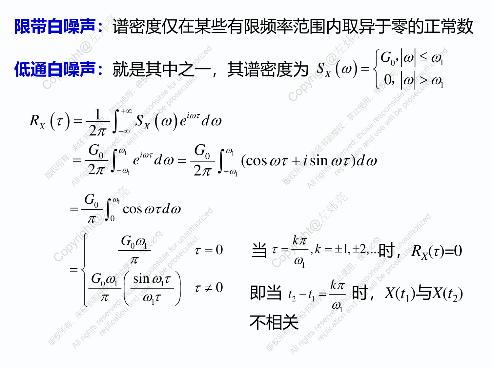

<!-- Start of picture text -->
限带白噪声： 谱密度仅在某些有限频率范围内取异于零的正常数  G 0， ω ≤ ω 1 低通白噪声： 就是其中之一，其谱密度为 S X (ω) =   0， ω > ω 1 +∞ 1 i ωτ = R τ S ω e d ω X ( ) X ( ) 2 π ∫−∞ G 0 ω 1 i ωτ G 0 ω 1 = e d ω = ωτ + i sin ωτ d ω (cos ) 2 π ∫−ω 1 2 π ∫−ω 1 G 0 ω 1 = ωτ d ω π ∫ 0 cos  G 0 ω 1 k π τ = 0 当 τ = , k = ± 1, ± 2,... 时， RX ( τ )=0 π ω =  1  G 0 ω 1  sin ωτ 1  τ ≠ 0 k π π  ωτ  即当 t 2 − t 1 = 时， X ( t 1) 与 X ( t 2)   1  ω 1 不相关 <!-- End of picture text -->

2 +∞ − +∞ _A_ − _i_ ωτ _i_ ωτ = = _S X_ ( ω ) _R X_ ( τ ) _e d_ τ cos( ω 0 τ ) _e d_ τ ∫−∞ ∫−∞ 2 − 2 _i_ ω τ _i_ ω τ _A_ +∞ _e_ 0 + _e_ 0 − _i_ ωτ _e i_ ω 0 τ + _e_ − _i_ ω 0 τ = _e d_ τ (cos( ω 0 τ ) = ) 2 ∫−∞ 2 2 2 +∞ _A_ − − _i_ ω τ _i_ ω τ _i_ ωτ 0 0 = （ _e_ + _e_ ） _e d_ τ ∫−∞ 4 2 +∞ _A_ − − _i_ ( ω 0 ω ) τ _i_ ( ω 0 +ω ) τ = _e_ + _e d_ τ ∫−∞ 4 2 π _A_ = − [ δ ( ω ω 0 ) + δ ( ω+ ω 0 )] 2 = ⇒ _R_ τ ω _X_ ( ) cos( 0τ ) = − ⇒ _S X_ ( ω ) π [ δ ( ω ω 0 ) + δ ( ω+ ω 0 )] 

#### **例 6 续** 

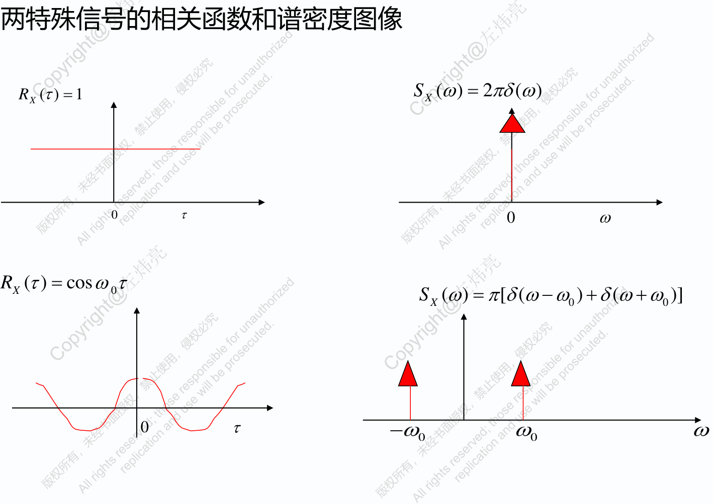

<!-- Start of picture text -->
两特殊信号的相关函数和谱密度图像 RX ( τ ) = 1 S X ( ω ) = 2 πδ ( ω ) 0 τ 0 ω R τ = cos ω τ X ( ) 0 S X ( ω ) = π [ δ ( ω− ω 0 ) + δ ( ω+ ω 0 )] 0 τ −ω ω ω 0 0 <!-- End of picture text -->

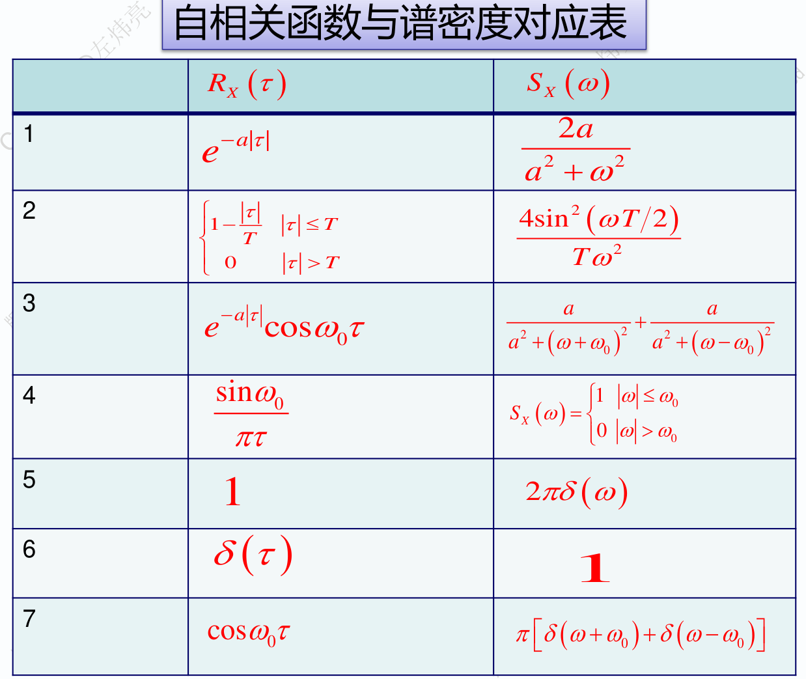

<!-- Start of picture text -->
自相关函数与谱密度对应表 R τ S ω X ( ) X ( ) 1 − 2 a a τ | | e 2 2 a + ω 2 − 1 τ τ ≤ T 4sin 2 ω T 2 ( )  T    0        τ > T T ω 2 3 − a τ a a + e cos ω τ 2 2 2 2 0 a + ω+ ω a + ω− ω ( 0 ) ( 0 ) 4 sin ω 0  1   ω ≤ ω 0 S X (ω) =  0  ω > ω πτ  0 5 2 πδ ω 1 ( ) 6 δ τ ( ) 1 7 − cos ω τ π δ ω+ ω + δ ω ω  0  ( 0 ) ( 0 ) <!-- End of picture text -->

2 _a_ − 2 α τ = _R_ τ cos ω τ + _b e_ **例 8** 求自相关函数 _X_ ( ) 0 2 

所对应的谱密度 _SX_ ( _ω_ ) **解：** 所要求的谱密度为 2 π 2 α _b_ 2 = − _S X_ ( ω ) _a_ [ δ ( ω ω 0 ) + δ ( ω+ ω 0 )] + 2 2 2 α + ω 

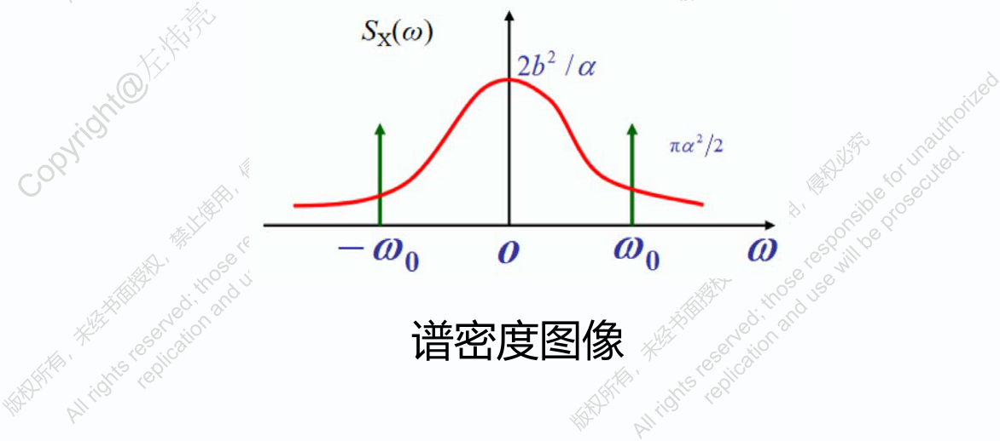

<!-- Start of picture text -->
谱密度图像 <!-- End of picture text -->

#### − _a_ τ = **例 9** 已知平稳过程 _X_ ( _t_ ) 的自相关函数为 _RX_ ( τ ) _e_ cos ω τ 0 

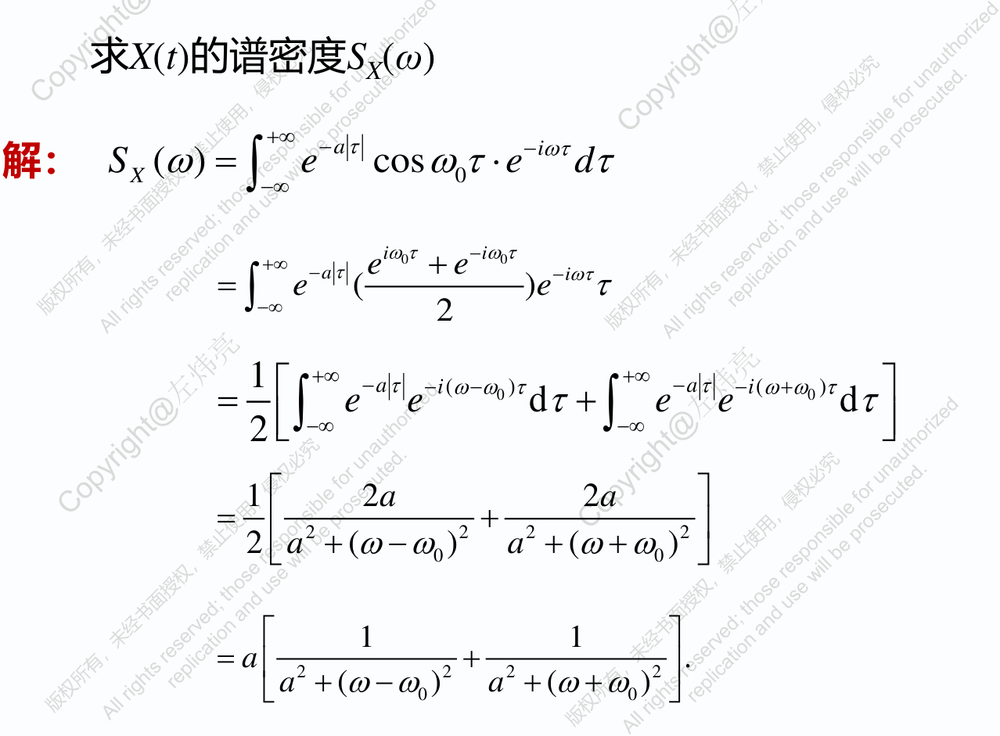

<!-- Start of picture text -->
求 X ( t ) 的谱密度 SX ( ω ) +∞ − a τ − i ωτ 解： S X ( ω ) = e cos ω τ 0 ⋅ e d τ ∫−∞ i ω 0 τ − i ω 0 τ +∞ − a τ e + e − i ωτ = e e τ ( )  ∫−∞ 2 1  +∞ − a τ − i ( ω−ω 0 ) τ +∞ − a τ − i ( ω+ω 0 ) τ  = e e d τ + e e d τ ∫−∞ ∫−∞  2   1  2 a 2 a  = +  2 2 2 2  − 2 a + ω ω a + ω+ ω  ( 0 ) ( 0 )   1 1  = a  2 2 + 2 2  . − a + ω ω a + ω+ ω  ( 0 ) ( 0 )  <!-- End of picture text -->

## 2 ***** ω + 4 **例 10** 已知谱密度 _S X_ ( ω ) = 4 2 ω + 10 ω + 9 求平稳过程 _X_ ( _t_ ) 的自相关函数和均方值 

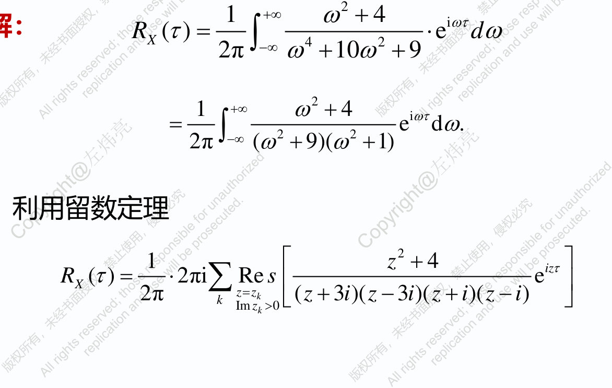

<!-- Start of picture text -->
2 1 +∞ ω + 4 i ωτ = ⋅ R τ e d ω X ( ) 4 2 ∫−∞ 2π ω + 10 ω + 9 2 1 +∞ ω + 4 i ωτ = e d ω . 2 2 ∫−∞ 2π ω + ω + ( 9)( 1) 利用留数定理 2 1  z + 4 iz τ  R τ = ⋅ 2πi Re s e X ( ) 2π ∑ k Im z = zzkk > 0  ( z + 3 )( i z − 3 )( i z + i )( z − i )  <!-- End of picture text -->

<!-- Start of picture text -->
解： <!-- End of picture text -->

2 1  _z_ + 4 _iz_ τ  = ⋅ _R_ τ 2πi Re _s_ e _X_ ( ) ∑  4 2  2π _k z_ = _zk z_ + 10 _z_ + 9 Im _zk_ > 0   1 −τ − 3 τ = (9e + 5e ) 48 7 = 均方值为 _RX_ (0) 24 

2 _n_ 2 _n_ − 2 ω + _a_ <u>2</u> _<u>n</u>_ − <u>2</u> ω + ... + _a_ <u>0</u> **说明** _S X_ ( ω ) = _S_ 0 2 _m_ 2 _m_ − 2 ω + _b_ 2 _m_ − 2 ω + ... + _b_ 0 **称为有理谱密度** 

其中 _S_ 0>0, _m_ > _n_ , 分母无实根 

#### **解法二** 2 ω + 4 = **例 11** 已知谱密度 _S X_ ( ω ) 4 2 ω + 10 ω + 9 求平稳过程 _X_ ( _t_ ) 的自相关函数和均方值 

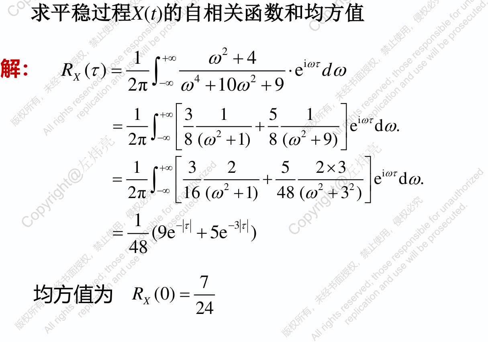

<!-- Start of picture text -->
求平稳过程 X ( t ) 的自相关函数和均方值 2 1 +∞ ω + 4 i ωτ = ⋅ 解： RX ( τ ) 4 2 e d ω ∫−∞ 2π ω + 10 ω + 9 1 +∞  3 1 5 1  i ωτ = + e d ω . ∫−∞  2 2  2π ω + ω +  8 ( 1) 8 ( 9)  1 +∞  3 2 5 2 × 3  i ωτ = + e d ω . ∫−∞  2 2 2  2π ω + ω + 3  16 ( 1) 48 ( )  1 − − τ 3 τ = (9e + 5e ) 48 7 = 均方值为 RX (0) 24 <!-- End of picture text -->

**例 12** 设平稳过程 _X_ ( _t_ ) ， _Y_ ( _t_ ) 是平稳相关的，它们的自谱密度和互 谱密度分别为 _SX_ ( _ω_ ) ， _SY_ (ω) ， _SXY_ (ω) ，证 _Z_ ( _t_ )= _X_ ( _t_ )+ _Y_ ( _t_ ) 是平稳过程， 并求其自谱密度 

= = **解：** _E_ [ _Z_ ( _t_ )] _E_ [ _X_ ( _t_ )] + _E Y_ [ ( _t_ )] _mX_ + _mY_ = _R t t_ +τ _E Z t Z t_ +τ _Z_ ( , ) [ ( ) ( )] = _E X t_ + _Y t X t_ +τ + _Y t_ +τ [ ( ) ( )][ ( ) ( )] { } = _E X t X t_ +τ + _E Y t Y t_ +τ [ ( ) ( )] [ ( ) ( )] + _E X t Y t_ +τ _E Y t X t_ +τ [ ( ) ( )] [ ( ) ( )] = _R_ τ + _R_ τ + _R_ τ + _R_ τ _X_ ( ) _Y_ ( ) _XY_ ( ) _YX_ ( ) _t_ 均值和自相关函数均与 无关，所以是平稳过程 

#### 计算自谱密度 

= _R_ τ) _R_ τ + _R_ τ + _R_ τ + _R_ τ Z( _X_ ( ) _Y_ ( ) _XY_ ( ) _YX_ ( ) 在等式两边取傅里叶变换，得 = _S_ Z( ω) _S X_ ( ω ) + _SY_ ( ω ) + _S XY_ ( ω ) + _SYX_ ( ω ) = _S X_ ( ω ) + _SY_ ( ω ) + _S XY_ ( ω ) + _S XY_ ( ω ) = _S X_ ( ω ) + _SY_ ( ω ) + 2Re [ _S XY_ ( ω ) ] 

#### **12.4 各态历经性** 

从一次试验所获得的一个样本函数来决定随机过程的均值和自相 关函数，从而就可以得到该过程的全部信息，即 **各态历经** 问题 **1. 基本概念 1 定义** _X t t_ 设 { ( ),-∞< <+ ∞} 为随机过程 1 _T_  < _X_ ( _t_ ) > (m.s.) lim _X_ ( _t_ ) _dt_ 2 _T_ ∫− _T T_ →+∞ 称 < _X_ ( _t_ )> 为沿整个时间数轴上的时间均值 1 _T_  < _X t_ +τ _X t_ > lim _X t_ +τ _X t dt_ ( ) ( ) (m.s.) ( ) ( ) 2 _T_ ∫− _T T_ →+∞ 称 < _X_ ( _t_ + _τ_ ) _X_ ( _t_ )> 为沿整个时间数轴上的时间均值 

**定义 2** 设 _X_ ( _t_ ) 是一个均方连续平稳过程 = < **_X t_** >= **_E X t m_** 若 **( ) [ ( )]** **_X_** 则称 _X_ ( _t_ ) 具有数学期望的 **各态历经性** （也称遍历性） = 若 < _X_ ( _t_ +τ ) _X_ ( _t_ ) >= _E_ [ _X_ ( _t_ +τ ) _X_ ( _t_ )] _RX_ ( τ ) 则称 _X_ ( _t_ ) 具有相关函数的 **各态历经性** 

如果 _X_ ( _t_ ) 数学期望、相关函数都具有各态历经性 则称 _X_ ( _t_ ) 具有 **各态历经性** ，或者称 _X_ ( _t_ ) 为各态历经过程 

**例 13** 试讨论 _X_ ( _t_ )= _a_ cos( _ωt_ + _U_ ),-∞< _t_ <+ ∞ ，是否具有各态历经性 . 其中 _a_ , _ω_ 是常数， _U_ 是在 [0,2π] 上服从均匀分布的随机变量 

**解 :** _E_ [ _X_ ( _t_ )] = _E_ [ _a_ cos(ω _t_ + _U_ )] 2 π 1 = _a_ cos(ω _t_ + _x_ ) _dx_ = 0 ∫ 0 2 π 2 π 1 2 = _E X t_ +τ _X t a_ ω _t_ +τ + _x_ ω _t_ + _x dx_ [ ( ) ( )] cos[ ( ) ]cos( ) ∫ 0 2 π 2 _a_ = cosω τ 2 

1 _T_ = < _X_ ( _t_ ) > (m.s.) lim 2 _T_ ∫− _T a_ cos(ω _t_ + _U_ ) _dt T_ →+∞ _a_ cos _U_ sinω _T_ = (m.s.) lim = 0 _T_ →+∞ ω _T_ 1 _T_ 2 < _X_ ( _t_ +τ ) _X_ ( _t_ ) > = (m.s.) lim _a_ cos[ω( _t_ +τ ) + _U_ ]cos(ω _t_ + _U_ ) _dt_ 2 _T_ ∫− _T T_ →+∞ 

ω _t_ + ωτ + 2 _U_ + ωτ 1[cos(2 ) cos( )] 2 2 _a_ = cosω τ 2 < _X t_ >= _E X t_ **故有** ( ) [ ( )] < _X t_ +τ _X t_ >= _E X t_ +τ _X t_ ( ) ( ) [ ( ) ( )] **即此过程是具有各态历经性** 

**例 14** 研究随机过程 _X_ ( _t_ )= _Y_ (-∞< _t_ <+∞) 的各态历经性，其中 _Y_ 为随机 _Y Y_ 变量，且 D( )≠0 ， D( )<+∞ 

**解：** 因为 _Y_ 为随机变量，且存在有限的二阶矩， 

> 所以 _E_ [ _X_ ( _t_ )] = _E_ ( _Y_ ) =常数 

> 2 2 

> = = _E_ [ _X_ ( _t_ +τ ) _X_ ( _t_ )] _E_ [ _Y_ ] _D_ ( _Y_ ) + [ _E_ ( _Y_ )] < +∞ 由此知 _X_ ( _t_ ) 是平稳过程 1 _T_ = 由于 < _X_ ( _t_ ) >= (m.s.) lim _Ydt Y_ 不是常数 − 2 _T_ ∫ _T T_ →+∞ 

> **故** < _X_ ( _t_ ) >≠ _E_ [ _X_ ( _t_ )] **即** **_X_ (** **_t_ ) 不具有各态历经性** 

**注** 各态历经性随机过程一定是平稳过程，但平稳过程不一定具 备各态历经性 

**2. 各态历经性定理 1 定理 数学期望的各态历经性定理** 

设 { _X_ ( _t_ ),-∞< _t_ <+ ∞} 为均方连续平稳过程，则 _X_ ( _t_ ) 有均值 **各态历 经性** 的充要条件为 

1 2 _T_ τ  <u>| |</u>  2 − − = lim 1 _R_ τ _m d_ τ 0 _T_ →+∞ ∫− 2 _T_   ( _X_ ( ) ) 2 _T_ 2 _T_   其中 _E_ [ _X_ ( _t_ )]= _m_ , _RX_ ( _τ_ ) 是相关函数， _τ_ = _t_ 1- _t_ 2 

#### **引理** 设 { _X_ ( _t_ ),-∞< _t_ <+ ∞} 为均方连续平稳过程， 

1 _T_ 且 _E_ [ _X_ ( _t_ )] = _m Y_ = _X_ ( _t_ ) _dt_ 2 _T_ ∫− _T_ = = **则** _E_ [ _Y_ ] _E_ [ _X_ ( _t_ )] _m_ 1 _T T_ = − _D_ ( _Y_ ) _C_ ( _t_ 1 _t_ 2 ) _dt dt_ 1 2 2 ∫∫− _T_ − _T_ 4 _T_ 

**证** 

#### 由均方可积条件得 

1 _T_ 1 _T_ = = = _E_ ( _Y_ ) _E_ [ _X_ ( _t_ ) _dt_ ] _E_ [ _X_ ( _t_ )] _dt m_ 2 _T_ ∫− _T_ 2 _T_ ∫− _T_ 1 _T T_ 2 = ⋅ _E_ ( _Y_ ) _E_ [ _X_ ( _t_ 1) _dt_ 1 _X_ ( _t_ 2 ) _dt_ 2 ] 2 ∫− _T_ ∫− _T_ 4 _T_ 1 _T T_ = _E_ [ _X_ ( _t_ 1) _X_ ( _t_ 2 )] _dt_ 1 _dt_ 2 2 ∫∫− _T_ − _T_ 4 _T_ **1** **_T T_** = − **_X_ (** **_t_ 1** **_t_ 2 )** **_dt_ 1** **_dt_ 2 2** ∫∫− **_T_** − **_T_****_R_** **4** **_T_** 2 2 **所以** _<mark>D</mark>_ ( _Y_ ) = _E_ ( _Y_ ) − [ _E_ ( _Y_ )] **1** **_T T_** 2 = − − **_X_ (** **_t_ 1** **_t_ 2 )** **_dt_ 1** **_dt_ 2** _m_ **2** ∫∫− **_T_** − **_T_****_R_** **4** **_T_** 

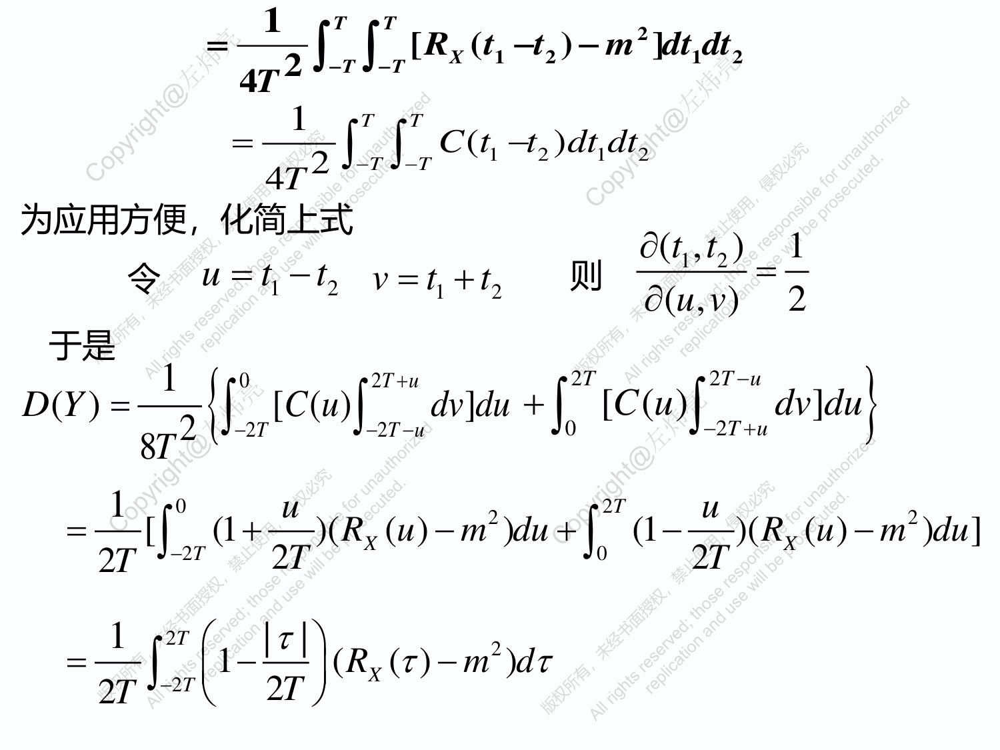

<!-- Start of picture text -->
1 T T 2 = − − [ X ( t 1 t 2 ) m ] dt 1 dt 2 2 ∫∫− T − T R 4 T 1 T T = − ( t 1 t 2 ) dt dt 1 2 2 ∫∫− T − T C 4 T 为应用方便，化简上式 ∂ t t 1 ( 1, 2 ) 令 u = t 1 − t 2 v = t 1 + t 2 则 ∂ u v = 2 ( , ) 于是 − 1 0 2 T + u 2 T 2 T u D ( Y ) = [ C ( u ) dv ] du + [ C ( u ) dv ] du 2 ∫− 2 T ∫− 2 T − u ∫ 0 ∫− 2 T + u { } 8 T 1 0 u 2 T u 2 2 = − − − [ (1 + )( RX ( u ) m ) du + (1 )( RX ( u ) m ) du ] 2 T ∫− 2 T 2 T ∫ 0 2 T 1 2 T τ  | |  2 = − − 1 R τ m d τ 2 T ∫− 2 T  2 T  ( X ( ) ) <!-- End of picture text -->

**定理证** 2 2 = − 由引理得 _<mark>D</mark>_ ( _Y_ ) _E_ ( _Y_ ) [ _E_ ( _Y_ )] 1 _T_ 2 = − _E_ { _X_ ( _t_ ) _dt E_ [ _X_ ( _t_ )] } 2 _T_ ∫− _T_ **1 2** **_T_** τ **<u>| |</u> 2** = − − **_R_** τ **_m d_** τ **(1 )(** **_X_ ( ) ) 2** **_T_** ∫− **2** **_T_ 2** **_T_** 1 _T_ 2 − = 从而 lim _E_ { _X_ ( _t_ ) _dt E_ [ _X_ ( _t_ )] } 0 _T_ →+∞ ∫− _T_ 2 _T_ **1 2** **_T_** τ **<u>| |</u> 2** − − = **lim** **_R_** τ **_m d_** τ **0 (1 )(** **_X_ ( ) )** **_T_** →+∞ ∫− **2** **_T_ 2** **_T_ 2** **_T_** 1 _T_ = 故 < _X_ ( _t_ ) >= (m.s.) lim _X_ ( _t_ ) _dt E_ [ _X_ ( _t_ )] _T_ →+∞ 2 _T_ ∫− _T_ **1 2** **_T_** τ **<u>| |</u> 2** − − = **lim** **_R_** τ **_m d_** τ **0 (1 )(** **_X_ ( ) )** **_T_** →+∞ ∫− **2** **_T_ 2** **_T_ 2** **_T_** 

**1 2** **_T_** τ **<u>| |</u> 2** 注 若 0≤ _t_ <∞ ，则 **lim (1** − **)(** **_RX_ (** τ **)** − **_m_ )** **_d_** τ = **0** **_T_** →+∞ ∫− **2** **_T_ 2** **_T_ 2** **_T_ 1** **_T_** τ **2** − − = **lim** **_R_** τ **_m d_** τ **0** 可表示为 **(1 )(** **_X_ ( ) )** **_T_** →+∞ ∫ **0** **_T T_** 

**2 定理** 自相关函数 **各态历经性** 定理 设 { _X_ ( _t_ ),-∞< _t_ <+∞} 是均方连续平稳过程 _Z_ = _X_ ( _t_ + λ ) _X_ ( _t_ ) 则相关函数 _RZ_ ( _τ_ ) 具有 **各态历经性** 的充要条件为 

**1 2** **_T_** τ **<u>| |</u> 2** − − = **lim** **_R_** τ **_m d_** τ **0 (1 )( ( ) )** **_T_** →+∞ ∫− **2** **_T z z_ 2** **_T_ 2** **_T_** = 其中 _RZ_ ( τ ) _E_ [ _X_ ( _t_ + λ+τ ) _X_ ( _t_ +τ ) _X_ ( _t_ + λ ) _X_ ( _t_ )] = _m E X t_ + λ _X t Z_ [ ( ) ( )] **证** 将定理 1 中的 _X_ ( _t_ ) 换成 _X_ ( _t_ + _λ_ ) _X_ ( _t_ ) 即可证明 **1** **_T_** τ **2** 注若 0≤ _t_ <∞ ，则 **lim** − **_R_** τ − **_m d_** τ = **0 (1 )(** **_Z_ ( )** **_Z_ )** **_T_** →+∞ ∫ **0** **_T T_** 

#### **随机过程小结** 

- 1 _X t ω t_ ∈ _Τ ω_ ∈Ω 、随机过程 ( , ) 是关于 , 的二元映射，即： 

⋅⋅ _X T_ ×Ω  _R_ . ( , ) : 2 、 _X_ ( _t_ ) 的一维分布函数： _Ft_ ( _x_ )= _P_ { _X_ ( _t_ )≤ _x_ } = _F x x P X t_ ≤ _x X t_ ≤ _x X_ ( _t_ ) 二维分布函数： _t_ 1 , _t_ 2 ( 1, 2 ) { ( 1) 1, ( 2 ) 2} _X t_ 会计算随机过程 ( ) 一维、二维的分布函数 

- 3 、随机过程 X(t) 的均值函数、方差函数、自相关函数、自协 方差函数的计算与相互关系 

= _m_ ( _t_ ) = _E_ [ _X_ ( _t_ )] _R_ ( _t_ 1, _t_ 2 ) _E_ [ _X_ ( _t_ 1) _X_ ( _t_ 2 )] 2 _D_ ( _t_ ) = _E_ [ _X_ ( _t_ ) − m(t)] _R_ ( _t_ , _t_ ) = _D_ ( _t_ ) + _m_ ( _t_ ) 2 2 = _E_ [ _X_ ( _t_ )] − m (t) = − − _CX_ ( _t_ 1, _t_ 2 ) _E_ [( _X_ ( _t_ 1) _m_ ( _t_ 1))( _X_ ( _t_ 2 ) _m_ ( _t_ 2 ))] = − _R t t m t t_ ( 1, 2 ) ( 1)m( 2 ) = _D_ ( _t_ ) _C_ ( _t_ , _t_ ) 

4 、两个随机过程 _X_ ( _t_ ) 、 _Y_ ( _t_ ) 的互相关函数、互协方差函数的计 算与相互关系 

= _RXY_ ( _t_ 1, _t_ 2 ) _E_ [ _X_ ( _t_ 1) _Y_ ( _t_ 2 )] = − − _CXY_ ( _t_ 1, _t_ 2 ) _E_ [( _X_ ( _t_ 1) _mX_ ( _t_ 1))( _Y_ ( _t_ 2 ) _mY_ ( _t_ 2 ))] = − _R t t m t m t XY_ ( 1, 2 ) _X_ ( 1) _Y_ ( 2 ) 若对任意的 _t_ 1, _t_ 2, _CXY_ ( _t_ 1, _t_ 2)=0 ，则 _X_ ( _t_ ) 和 _Y_ ( _t_ ) 互不相关，此时 

_RXY_ ( _t_ 1, _t_ 2 )= _mX_ ( _t_ 1) _mY_ ( _t_ 2 ) 

#### 5 、几个重要的随机过程 

二阶矩过程：对于每一个 _t_ ∈ _T_ ，二阶矩 _E_ [ _X_ ²( _t_ )] 都存在 正态过程：对任意正整数 _n_ ≥1, 和 _n_ 个不同的 _t_ 1, _t_ 2,…, _tn_ ∈ _T_ ， _X t X t X t N Σ_ { ( 1), ( 2),…, ( _n_ )} ~ _n_ ( _μ_ , ) 正交增量过程：若随机过程 { _X_ ( _t_ ) , _t_ ≥0} 为二阶矩过程， 且对任意的 0≤ _t_ 1< _t_ 2 ≤ _t_ 3< _t_ 4 ，恒有 _E_ [( _X_ ( _t_ 2)- _X_ ( _t_ 1))( _X_ ( _t_ 4)- _X_ ( _t_ 3))]=0 独立增量过程：对 _n_ 个不同的 _t_ 1< _t_ 2<…< _tn_ ∈ _T_ , _X_ ( _t_ 2) - _X_ ( _t_ 1), _X_ ( _t_ 3) - _X_ ( _t_ 2), …, _X_ ( _tn_ ) - _X_ ( _tn_ -1) 相互独立 平稳独立增量过程：独立增量过程 _X_ ( _t_ ) 的任意增量 _X_ ( _s_ + _t_ )- _X_ ( _s_ ) ( _s_ ≥0, _t_ >0) 的概率分布与 s 无关 

#### **泊松过程** 

_N t t_ 令 { ( ), ≥0} 为计数过程，若它满足条件 

- （ 1 ） _N_ (0)=0 

- （ 2 ）是独立增量过程 （ 3 ）对任意的 _s_ ≥0, _t_ ≥0 

_k_ <u>(</u> λ _t_ <u>)</u> −λ _t P_ { _N_ ( _t_ + _s_ ) − _N_ ( _s_ ) = _k_ } = _e_ , _k_ = 0,1,2,... _k_ ! **性质：** _N_ ( _t_ )= _N_ ( _t_ )- _N_ (0) ~ _P_ ( _λt_ ), _E_ [ _N_ ( _t_ )]= _λt     D_ [ _N_ ( _t_ )]= _λt   C_ ( _s_ , _t_ )= _λmin_ { _s,t_ } 

#### **布朗运动** 

定义：设 { _W_ ( _t_ ) ， _t_ ≥0} 为随机过程，若它满足 

- （ 1 ） _W_ (0)=0 

- （ 2 ）是独立增量过程 

- 

- （ 3 ）增量 _W_ ( _t_ )- _W_ ( _s_ )~ _N_ (0,| _t s_ | _σ_ ²), _σ_ >0 

则称 { _W_ ( _t_ ) ， _t_ ≥0} 为布朗运动 

**性质：** （ 1 ） { _W_ ( _t_ ), _t_ ≥0} 是平稳独立增量过程 

- （ 2 ）对每个 _t_ >0 ， _W_ ( _t_ ) ~ _N_ (0, _s_2 _t_ ) ，且 { _W_ ( _t_ ), _t_ ≥0} 为正态过程 

（ 3 ） _mw_ ( _t_ )=0, _Cw_ ( _s_ , _t_ )= _Rw_ ( _s_ , _t_ )= _σ_ ²min( _s_ , _t_ )( _s_ , _t_ ≥0) 

- 6 、严平稳和宽平稳过程，会验证一个随机过程是不是宽平 

- 稳过程 

      - _X t_ ( ) 为宽平稳过程满足条件： 

   - 1 _E X t m m_ 

   - （ ） [ ( )]= , 为常数； 

   - （ 2 ）对任意的 _t_ ∈ _T_ , _τ_ ∈ _T_ , _E_ [ _X_ ( _t_ ) _X_ ( _t_ + _τ_ )] 不依赖于 _t_ ; 

7 、 **各态历经性** 定理；会验证 _X_ ( _t_ ) 是否具有 **各态历经性** = < _X t_ >= _E X t m_ ( ) [ ( )] _X_ (a.s) = < _X t_ +τ _X t_ >= _E X t_ +τ _X t R_ τ ( ) ( ) [ ( ) ( )] _X_ ( )(a.s) 

#### 8. 谱密度和相关函数之间的关系（计算谱密度） 平稳过程 _X_ ( _t_ ) 的功率谱密度 

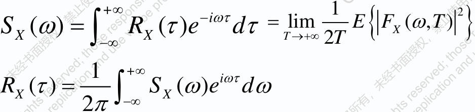

谱密度是非负、实的、偶函数 平稳过程 _X_ ( _t_ ) 和 _Y_ ( _t_ ) 的互谱密度 

+∞ − i ωτ 1 = = − _S XY_ ( ω ) _RXY_ ( τ )e d τ lim _E_ { _FX_ ( ω , _T_ ) _FY_ ( ω , _T_ )} ∫−∞ _T_ →+∞ 2 _T_ 1 +∞ i ωτ _RXY_ ( τ ) = _S XY_ ( ω )e d ω ∫−∞ 2π 

